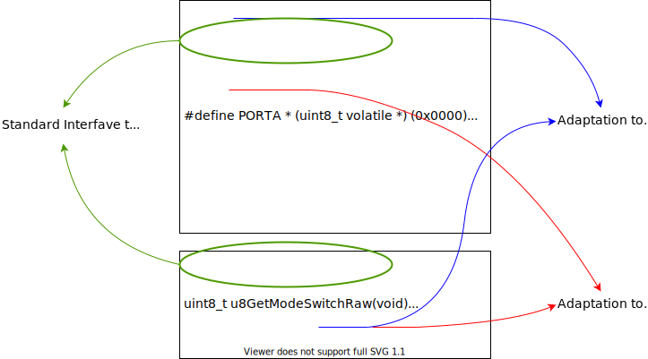

# 소프트웨어 구조와 프래임워크


## 시작하는 질문

눈에 보이지 않는 소프트웨어를 어떻게 구조화 한다는 말이지?

소프트웨어의 구조와 구조화란 무엇일까?

------


## References

* [AUROSAR Classic Platform](https://www.autosar.org/standards/classic-platform/)

**[Example Code]**

* [NONE]

**[강의 영상]**

*   [SW 구조로 얻을 수 있는 장점](https://drive.google.com/file/d/16YGYYwft4EZqYiwkK8qQ4c6kd0SyQ_VS/view?usp=sharing)
*   [하드웨어 추상화 계층과 운영체계 추상화 계층](https://drive.google.com/file/d/1hl8litHF3RJydke84yXvOuQRacX2Gqlv/view?usp=sharing)
*   [물리계층, 실행 프래임워크, 그리고 라이브러리](https://drive.google.com/file/d/1KMc9GU6T__c0KBvnHtZf-5BgIdjTnwT8/view?usp=sharing)


## Experiment & Exercise

* 요구사항 수집 및 시스템 설계 (Optional)
* 소프트웨어 상위 레벨 설계
* 소프트웨어 객체(SWC) 구조 프로그래밍

**[자료]**

* EST_MoBeE_Exercise/markdown/1_SoR_UseCases.pdf
* EST_MoBeE_Exercise/markdown/2_SyRS.pdf
* EST_MoBeE_Exercise/markdown/3_SwDesign.pdf
    * High level design 
* EST_MoBeE_Exercise/markdown/3_InterfacesParameters.xlsx
    * interfaces

**[Code]**

* EST_MoBeE Folder structure

**[실습영상]**

* [요구사항 정리](https://drive.google.com/file/d/1W8jICtiDo7aHKQMBWXFh4SWfrkXKnaKb/view?usp=sharing) (Optional)
* [시스템 요구사항 명세화](https://drive.google.com/file/d/1nIabKiyQcJyHFxzXwLu0v2TCQ1c568Bm/view?usp=sharing) (Optional)
* [소프트웨어 상위 레벨 설계](https://drive.google.com/file/d/1zn5YwPK3NtXopJgbsLcntMGEYePr1zJp/view?usp=sharing)
* [소프트웨어 상위레벨 설계에 따른 파일 관리](https://drive.google.com/file/d/1cIMAFbdryAcBhyWxMcE25PqJjqTNFruh/view?usp=sharing)
* [SensorSWC 구조 구현](https://drive.google.com/file/d/1GbUsAzfDfclbmBjXYV9R_iBT0SZR93Zy/view?usp=sharing)
* [ApplicationSWC 와 ActuatorSWC 구조 분석](https://drive.google.com/file/d/1h5ZXgE6YqYwHa2Ez2xnHFSWZSa9O7Cby/view?usp=sharing)


------


## Objectives

* 제어시스템 혹은 신호처리시스템에 적합한 소프트웨어 아키텍쳐에 대해 살펴보고
* 구성 요소별 특징을 이해한다.


## 서론

* 지난 수년간 “소프트웨어 구조”에 대하여 많은 연구
    * 대규모 프로그램을 위한 소프트웨어 구조

* 이와 같은 표준적인 소프트웨어 구조는 마이크로컨트롤러용으로 사용하기에 부적합

* 마이크로컨트롤러 프로그램에는 소프트웨어 구조가 필요없다? 아니다. 더욱 더 잘 설계된 소프트웨어 구조 필요
    - 비기능적 요구사항에 부합하는 소프트웨어 구조
    - 표준적인 구조에서 필수적인 요소만 채택
    - 자원을 낭비할 수 있는 요소는 과감히 생략

[핵심]
* 일반적인 표준 구조는 일반적으로 마이크로컨트롤러에 적용하기에 너무 크고 무겁다.
* 마이크로컨트롤러를 위한 소프트웨어 구조는 표준적인 구조에서 필수적인 요소들만 선택적으로
채택하여 오버헤드가 최소화 될 수 있도록 하여야 한다.


## 소트트웨어 구조

* 마이크로컨트롤러 소프트웨어를 위한 구조를 제시
    - 절대적이라기 보다는 참고로 여길 것
    - 필요에 따라 변형하여 사용
    
    


* 마이크로컨트롤러와 운영체계는 주어진 것으로 간주

* 마이크로컨트롤러
	
	* CPU 와 많은 입출력 장치들로 구성
* 운영체계
    - 운영체계는 운영체계 자체는 마이크로컨트롤러와 상당히 밀접한 관계를 가지고 있음
    - 보통 필요한 기능을 구현하기 위하여 고급 프로그래밍 지식을 필요로 하고 전문적인 팀에
    의하여 체계적으로 개발하여야 함.
    - 일반적으로 소프트웨어 개발시 운영체계는 함께 개발하는 것 보다는 기성품을 사용하거나
    별도의 팀에서 개발하여 사용.
    - 운영체계를 어떻게 다른 소프트웨어 부분과 연결하는 지가 중요한 사항

* 하드웨어 추상계층과 운영체계 추상 계층
    - 하드웨어와 운영체계를 활용하기 위하여 특별히 고안
    - 이 계층 자체는 재사용이 불가능
    - 이 계층을 통하여 상위의 소프트웨어 컴포넌트에 대한 비기능적 요구사항을 만족시킬 수 있음
    
    

### 소프트웨어 구조로 얻을 수 있는 장점

* 이식성 향상
    - 가능한 한 많은 소프트웨어 컴포넌트를 이식가능하게 할 수 있음
    - 표준 C 언어로 프래임워크, 기능블럭, 물리계층, 기능 라이브러리를 프로그래밍 할 것
    - 특정 컴파일러 혹은 CPU 의 관련 기능은 C 라이브러리에 모아둘 것

* 재사용성 향상
    - 이식이 가능한 부분은 동시에 재사용이 가능해짐
    - 재사용성을 더욱 향상 시키기 위해 물리계층을 도입함
    - 하드웨어에 의존하는 각종 값과 이 값을 사용해야 하는 기능 블록 사이에 물리계층을 도입하여 물리량과 하드웨어의 값의 변환을 담당; 기능블럭의 재사용성을 더욱 높여줄 수 있음

* 유지보수성 향상
    - 소프트웨어를 용도 및 성격에 따라 모듈과 계층으로 나누어 구성
    - 상호 의존성을 최대한 낮추고 각각의 고유한 기능을 명확히 하여줌
    - 모듈 설계를 통하여 유지보수성을 더욱 향상시킬 수 있음

**[핵심] 마이크로컨트롤러용 소프트웨어 구조**
* 마이크로컨트롤러 부분과 운영체계를 정의하고 이 컴포넌트를 연결할 수 있어야 한다.
* 하드웨어 추상화 계층과 운영체계 추상화 계층을 사용하여 마이크컨트롤러와 운영체계
컴포넌트를 연결할 수 있다
* 이와 같은 소프트웨어 구조를 사용함으로 이식성, 재사용성, 유지보수성을 높일 수 있다.


## 하드웨어 추상화 계층 (HAL: Hardware Abstraction Layer)

* 마이크로컨트롤러의 하드웨어 부분과 소프트웨어의 나머지 부분을 분리하는 목적
	- 마이크로컨트롤러의 하드웨어/컴파일러 의존적인 부분을 한 곳을 모으자.
	- 물리계층에 표준적인 인터페이스를 제공
    - 하드웨어 의존적인 부분, 혹은 컴파일러 의존 적인 부분을 접근하는 방법으로 내부 구현
    - 구현되는 하드웨어에 따라 변경이 있는 부분을 내부 구현

* 하드웨어 추상화 계층을 만들 때 염두에 둘 것들
	- 마이크로컨트롤러 하드웨어의 전 범위를 다뤄야 한다; 일부만 추상화 하면 결국은 추상화 되지 않은 부분에 의해 의미가 없어진다.
	- 간단하고 일관성 있는 인터페이스를 설계해야 한다.; 모듈명을 최대한 활용

```c
// 1. 장치 초기화를 위한 간단한 초기화 함수 제공
void Can_Init(void), void Sci_Init(void)

// 2. 간단한 자료를 주고 받을 경우는 “get”, “set”을 활용
uint8_t Dio_u8GetSwitchRaw(void)

// 3. 버퍼를 전달할 경우는 버퍼 포인터와 버퍼 길이를 함께
void Sci_vLoadTxBuffer(uint8_t * TxBuffer, uint8_t Length)

//4. 특정 동작을 시작시키고자 할 때 단순한 시작함수로.
void Sci_vTxStart(void)
```


[하드웨어 추상화 계층의 예: 스위치 상태 판별 함수]




**[핵심]**

* 하드웨어 추상화 계층은 컴파일러/CPU 등의 일반적이지 않은 요소들을 포함한다.
* 하드웨어 추상화 계층은 하드웨어의 특이한 요소들을 포함한다.
* 하드웨어 추상화 계층은 다음의 일반적인 함수들로 구성될 수 있다.; 초기화, 버퍼 다루기, 개별
    자료 접근, 트리거 동작 등등


## 운영체계 추상화 계층 (Operating System Abstraction Layer)

* OS 추상화 계층은 일반적으로 널리 사용되지는 않는다.
	- 운영체계 추상화 계층은 여러 플랫폼 혹은 여러 운영체계 상에서 입출력 장치를 다룰 때 매우 도움이 된다.
* 운영체계의 아주 간단한 기능만을 사용하는 경우
	- 추상화 계층이 필요없다.
*  운영체계의 복잡한 기능을 사용하는 경우
    - 이벤트 방식의 태스크 수행
    - 세마포어
    - 태스크간의 통신 등등
    - **[해결책 1] 표준적인 운영체계**를 사용한다.
    	: 자동차업계의 OSEK
    - **[해결책 2] 운영체계 추상화 계층**을 사용한다.
        : 하드웨어 추상화 계층과 같이 특정 운영체계에 대한 의존성을 감소시킨다.

[OS 추상화 계층의 예]


**[핵심]**

* 운영체계에 따라 달라질 수 있는 특징들, 세마포어 혹은 태스크간 통신 등,을 사용할 때는 운영체계 추상화 계층을 사용하는 것이 유익하다.


## 물리계층 (Physical Layer)

* HAL 을 통해서 얻은 값은 마이크로컨트롤러에서 직접적으로 사용하는 값이다. 프로그래머가 바로 이해하기에는 어려운 값
	- 직접적인 DIO 입력
	- timer 의 tick 값으로 표현된 시간
	- ADC 의 변환값
  
* 물리계층에서 응용프로그램에서 사용하기 위한 물리량, 가능하다면 정규화된 값으로 변환한다.
    - 물리량으로 변환시 충분한 정밀도를 갖도록 하여야 한다.
	    : 예를 들어 1V 의 정밀도는 불충분, 0.01V 의 정밀도 활용
    - 값의 변환을 위하여 Shift 연산을 최대한 활용하여 연산의 속도를 높인다.
    	: (operand) >>1 은 /2 의 효과, <<1 은 *2 의 효과
    	(ex) (ADC_value * 125) >> 6


**[예]** 8~16V 의 전압을 5V 의 입력범위를 갖는 10bit ADC 를 사용하여 읽어들이기

[물리계층과 물리량]


* 부가기능을 추가할 수 있다.
	- 디지털 입력의 디바운싱 혹은 아날로그 신호의 필터링


[물리계층과 디바운싱]


**[핵심]**

* 물리계층은 기능과 관계된 컴포넌트를 이식가능하게 만드는데 결정적인 도움을 준다.
* 물리계층은 하드웨어 추상화 계층의 가공되지 않은 물리값을 정규화된 물리값으로 변환하여 준다.
* 물리계층은 디바운스나 필터링과 같은 부가의 기능을 포함할 수 있다.


## 실행 프래임워크(Framework)

* 간단한 형태로 수행하고자 하는 함수들을 위한 틀을 제공
    * 개발자는 이 틀안에 필요한 기능을 프로그래밍
    * 이 프래임워크를 통하여 개발자는 한 모듈에서 전체 시스템의 제어흐름을 설계하고 구현할 수 있다.
    * 프래임워크는 마이크콘트롤러 소프트웨어 구조의 기본 구성요소

* 하나의 모듈별로 프레임워크를 구성하고 다음의 기능을 갖도록 한다.
    - **초기화 함수**: 다른 모듈의 초기화 함수를 호출, 시스템 초기화에서 이 함수가 호출되도록 구성
    - **주기적 태스크**: 주기적 동작을 연결, OS 에서 주기적으로 호출되는 태스크, (주의) 빠른 주기 태스크에서 느린 주기 태스크를 호출하는 방식으로 설계하지 말 것
    - **이벤트적 태스크**: 이벤트에 의해 시작되어야 하는 동작 연결
    - **백그라운드 태스크**: 시작 제약 사항이 없거나 낮은 동작 연결
    - 인터럽트 서비스는 이 프레임워크를 통해서 연결하지 말 것. 인터럽트 동작은 가능하면
HAL 에서 처리


[FIGURE 프래임워크와 하위계층과의 연결]


**[핵심]**

* 프래임워크는 하나의 모듈에 있어야 한다.
* 프래임워크는 각각의 주기적/이벤트적 태스크들을 수행시키는 함수를 가지고 있어야 한다.
* 프래임워크에 있는 각각의 함수는 태스크들의 제어흐름을 담고 있어야 한다.
* 자료들은 프래임워크 상에 흩어져 있으면 안된다. 프래임워크는 제어흐름에 영향을 줄 수 있는
자료들만 담고 있어야 한다.


## 라이브러리

* [라이브러리 예제](LibExample.md) 참고


## 구조와 관련된 덧붙이는 설명

* 제안한 구조를 활용하여 플랫폼 구성
    - 표준 하드웨어
    - 표준 OS
    - 표준 HAL
    - 표준 물리계층
    - 표준 실행 프래임워크
* 제안한 구조에서 추가될 수 있는 요소
    - 통신
    - 메모리 처리
    - 시스템 서비스

* 플랫폼이 가져야 하는 중요한 특징
	- Scalability, Flexibility
	- 응용 분야별로 응용 소프트웨어 부분도 계층화, 표준화가 가능하지만, 지나치게 표준화하는 것이 해결책은 아님
* [AUTOSAR Example](www.autosar.org)


* 경량형 AUTOSAR


## 모듈과 계층구조의 예

* _MoBeE 의 예_


