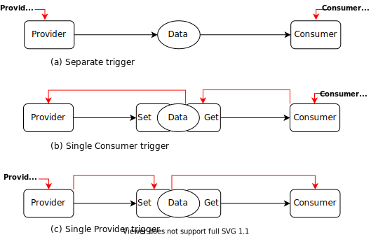
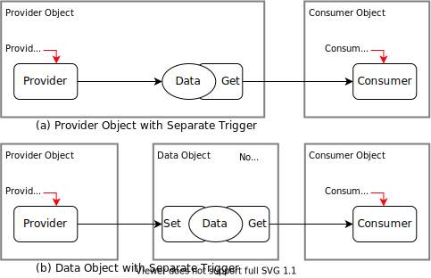

# 동작과 자료, 그리고 트리거


## 시작하는 질문

해야하는 일, 특히 응용소프트웨어 영역의 일들을 어떻게 일목요연하게 표현할 수 있을까?

그리고 그 표현을 어떻게 소프트웨어의 구현과 연관지을 수 있을까?

------


## References

* NONE


**[Example Code]**

* [NONE]

**[강의 영상]**

*   [동작과 데이타, 그리고 객체](https://drive.google.com/file/d/14gFxS0aSWmVONhztlyz6i_wZp4oXDOPm/view?usp=sharing)
*   [함수 호출과 Trigger](https://drive.google.com/file/d/136bfiHLitqsFWcfTevOgf5w3nH1wceDj/view?usp=sharing)
*   [예제 구조의 설명](https://drive.google.com/file/d/1UB_1T2RAbZmQppbTW-moeRvr3H53u-_Y/view?usp=sharing)


## Experiment & Exercise

* Application 구성하기
    * CheckError() 학습
    * ControlState() 완성하기

**[자료]**

* EST_MoBeE/markdown/3_SwDesign.pdf
* EST_MoBeE/markdown/3_InterfaceParameters.xlsx

**[Code]**

* Application

**[실습영상]**

* [ApplicationSWC - CheckError() 코드 분석](https://drive.google.com/file/d/1SMjbWbwfOgLRU_9zAPUJWQNW1crwuw8l/view?usp=sharing)

**[연습영상]**

* [ApplicationSWC - ControlState() 기능 구현](https://drive.google.com/file/d/1RjPTgTF0p1qORD9A3TpgLJGT3wFTv9tU/view?usp=sharing)

------


## Objectives

* 자료흐름 구조 설계 결과를 어떻게 코드로 구현할 수 있을까?


## 동작과 데이타 (Behavior 와 Data), 그리고 객체(Object)

* C 언어의 기본 구성 요소인 변수, 함수와 설계의 구성 요소인 동작, 데이타 (Behavior, Data)와의 대응 관계 분석 필요


### 동작과 데이타

* 자료를 공유할 때 전역변수를 사용하는 방법과 인터페이스 함수를 사용하는 방법이 있음

* 전역변수를 사용하는 방법

    * 단순하게 값만 공유할 경우
    * 가장 간단하게 구현할 수 있는 방법

* 인터페이스 함수를 사용하는 방법

    * 상대적으로 복잡할 수 있음
    * Data의 보호 및 간단한 값의 변환 등의 부가 기능을 넣을 수 있음

* 매크로 함수로 구현하는 인터페이스 함수

    * 형태상으로는 인터페이스 함수를 사용하지만 내용상으로는 변수에 직접 접근하는 매크로 함수를 사용할 수도 있음

    


```c
/* (a) by Global Variable */

data_type Data;

void Provider(void){
    Data = ...
}

void Consumer(void){
    ... = Data + ...
}
```

```c
/* (b) Interface functions */

static data_type Data;

void SetData(data_type param){
    Data = param;
}

data_type GetData(void){
    return(Data);
}

void Provider(void){
    ...
    SetData(my_value);
    ...
}

void Consumer(void){
    ... = GetData() + ...
}
```

```c
/* Interface function using Macro function */

#define SetData(x)  ((Data = )(x))
#define GetData()   (Data)

data_type Data;
```


### Object 와 Data 공유

* Object를 모듈(C 파일과 H파일 )로 구성하는 형태를 전제로 설명한다.
* Object 내의 Data
    * Object 외부로는 Data 의 접근을 불허한다.
    * Data를 File-Scope 의 정적 변수로 선언하고 사용
* Data와 Provider를 결합
    * 자연스러운 형태: 
        * Object 내의 하나의 동작코드에서만 Data를 쓸 수 있다.
        * 하나의 Data를 여러 Consumer에서 읽어갈 수 있다.
    * 외부에서 Data에 쓰기 접근을 금지하려면 Get 인터페이스를 통해서만 접근하도록 한다.

* Data와 Consumer를 결합
    * 부자연스러운 형태:
        * 여러 Object 에서 하나의 Data에 쓰기 접근을 할 수 있다.
        * 하나의 데이터를 여러 Consumer 에서 사용한다면 여러 곳에 Data가 존재해야 한다.
* Data Object를 별도로 관리하는 형태
    * 전역변수 Pool을 만들어서 사용하던 고전적인 Embedded Control SW의 변형된 형태
    * 전역변수와 관련된 동작들을 함께 관리하기 적합한 구조
        * Monitoring 및 Calibration 이 용이
        * Data Object를 변형해서 다른 Object들의 시험이 용이


## 함수 호출과 Triggering

* 공유되는 자료와 연관되는 동작의 호출을 구분할 필요
    * Separate Trigger 동작: 프레임워크(혹은 스케쥴러)에 의해서 호출되는 동작
    * Chain Trigger 동작: 인터페이스 함수에 의해서 호출되는 동작

### Separate Trigger와 Chain Trigger

* Separate Trigger 관계 동작: (a) Separate trigger

    * 프레임워크에서 개별적으로 호출하여야 한다.
    * 프레임워크에서 실행조건(주기와 순서)를 자유롭게 설정할 수 있으나
    * 주기와 순서에 따라서 성능이 달라질 수 있다. 

    ==> 세밀한 설계가 필요하다.

* Chain Trigger 관계 동작: (b) Single Consumer trigger, (c) Single Provider trigger
    * 데이터의 생성과 소비의 일련의 과정을 하나의 Trigger 만을 사용한다.
    * 프레임워크에서 실행조건을 개별적으로 조정할 수는 없으나
    * 같은 주기로 정의된 순서로 동작한다면 효율적으로 활용할 수 있다.




```c
/* (b) Single Consumer trigger                                      */
/* To get data, the GetData() should trigger Provider() internally  */
/* Developer needs to configure ONLY Consumer Trigger               */

void Consumer(void){
    ... GetData() ...
}

data_type GetData(void){  
    Data = Provider();    // Call Provider() to get Data
	return(Data);
}
```

```c
/* (c) Single Provider trigger                                      */
/* To set data, the SetData() should trigger Consumer() internally  */
/* Developer needs to configure ONLY Provider Trigger               */

void Provider(void){
    ... SetData() ...
}

void SetData(data_type param){  
    Data = param;
    Consumer(Data);    // Call Consumer() to set Data
}
```


## Trigger를 고려한 Object 패턴

* 함수의 구분: 형태로는 함수로 구현되지만 구분할 필요가 있는 요소

    * **프로시져**: 프레임워크에 의해서 호출되는 동작함수
    * 인터페이스: 데이타의 공유를 위한 단순 함수
    * 일반 함수: 라이브러리, 혹은 이와 준하는 형태로 만들어진 함수

    

### Application은 Separate Trigger를 활용

* Application을 구성하다 보면 각 프로시져의 실행 조건을 개별적으로 조정할 필요가 있다.

    * 그러므로 개별적인 트리거를 활용하는 것이 바람직하다.
    * 프레임워크에서 각 프로시져의 실행 주기와 순서를 명시적으로 조정해야 한다.

    

* Data와 Provider를 결합한 Object

    * 소규모, 중규모 프로젝트에서 유리하다.
    * Object 내에 Data와 생성하는 프로시져를 결합한다.

    

* 별도의 Data Object를 관리하는 방법

    * 대규모 프로젝트에서 유리하다.
    * Data Object 내에는 Data와 인터페이스만 존재할 뿐 
    * 프로시져는 존재하지 않는다.

    





### HAL과 연결은 Chain Trigger를 활용

* HAL과 Application을 연결할 때는 개별적인 프로시져를 만들어서 사용하기 보다는 필요할 때 호출해서 사용하는 것이 효율적이다.

    * 일반적으로 H/W를 사용하기 위해서는 Device Driver를 활용하므로 잘 갖춰진 인터페이스 함수를 사용할 수 있다.
    * 이렇게 하기 위해서는 H/W가 CPU의 간섭을 최소화한 상태로 동작할 수 있도록 세밀한 설정이 필요한다.
    * ADC의 Trigger 후 값의 변환 시간 지연 등

* 동기화 되지 않은 상태로 동작하는 부분, 주로 통신의 경우

    * Buffer와 프로시져 등을 사용하여 시간지연을 최소화하는 설계가 필요하다.

    


## 일반적인 제어시스템 SW의 객체 연결 관계


### [예제] MoBeE 


