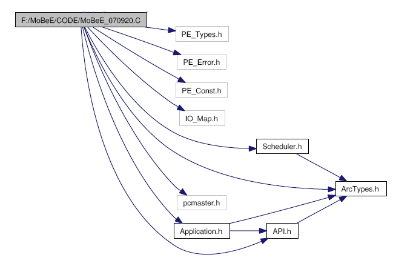
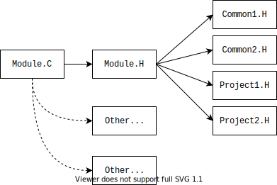
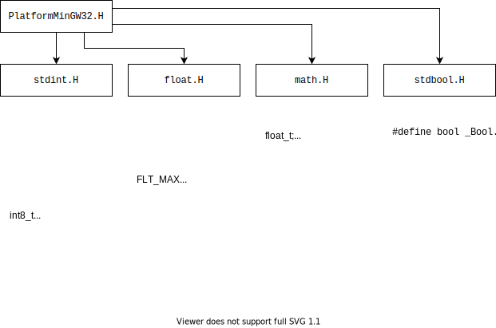
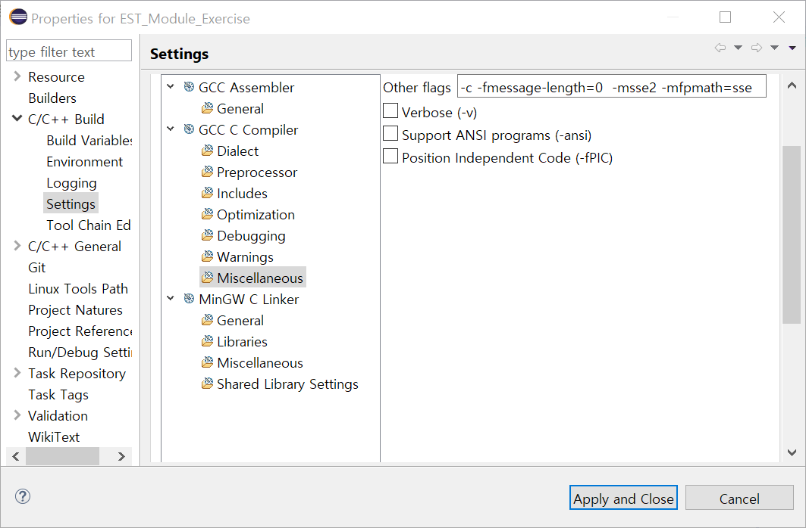

# 헤더파일의 인클루드 구조

## 시작하는 질문

* Standard library 를 사용할 때 헤더를 인클루드 해보기는 했는데.....
* 어떻게 헤더를 구성하는 것이 체계적일까?


## References

* NONE

**[Example Code]**

* /include/
    * PlatformTypes.h
    * PlatformMingw32.h
* /src/
    * CheckCompiler.c

**[강의 영상]**

* [Include 구조 설계 방법](https://drive.google.com/open?id=1-domEgxfBXBaHZnovtcVfTGlC3kO2-Jg)
* [include 구조: MinGW32 C99  활용시](https://drive.google.com/open?id=1gE4JBr8AJUy6y6WT4skKjXE3aX6dkyXQ)


## 서론

* 헤더파일에 대하여서도 많은 경우에 충분히 고려하여 설계하지 않는 경우가 대부분이다.
    * 우연히(?) 만들어 지는 경우가 대부분이고, 이것은 향후에 유지보수에 문제를 야기한다.

* 객체지향적 설계에서 헤더파일의 인클루드 구조는 많은 경우에 간과되는 영역
    * 실제 구현을 위하여 바람직한 형태를 언급할 필요가 있음

### Include 예



* 상기의 예는 실제 프로젝트의 헤더파일의 구조
    * 어느 정도 정리되어 보기 좋게 구성되어 있음
    * 실제의 경우 좀 더 복잡한 형태로 생성되는 경우가 많음
    * 소프트웨어의 구조가 없는 상태임 
    * 헤더파일이 지나치게 많이 인클루드 됨.


## 좋은 인클루드 구조를 만드는 법칙

1. 헤더파일의 **구조를 명확하게 계획하고 설계**하여야 한다.  헤더파일과 소스파일의 기본적인
내용으로 템플릿을 구성하고 이것을 반복적으로 사용하도록 한다.
2. 헤더파일의 인클루드 구조를 가능한한 **간단하고 논리적으로** 구성한다.
3. 가능한한 **인클루드 레벨을 낮게** 가지고 가도록 한다. 네스팅되거나 상호참조하는 인클루드
    형태를 피하자.
4. 헤더파일에는 **선언 중심의 내용으로 항상 깨끗하게** 유지하자.


## 좋은 인클루드 구조의 예

### 간단한 인클루드 구조

* 모듈헤더 파일은 그 모듈의 외부 모습을 의미한다.
    * 외부에서 참조할 필요가 있는 선언만 모듈헤더 파일에 담도록 한다.
    * 변수와 함수의 정의는 모듈 소스파일 (C 파일)에서 하도록 하자
* 모듈헤더 파일은 모듈에서 사용할 헤더 파일을 모두 인클루드 하도록하고,
  * 모듈소스파일은 이 헤더파일만을 인클루드 하도록 한다.
  * 다른 모듈의 참조가 필요하다면 그 모듈의 헤더를 소스파일에서 인클루드 하도록 한다.

* 모듈의 헤더에서 공통적으로 필요로 하는 헤더파일들는
    * 팀에서 공통적으로 사용할 필요가 있는 부분과
    * 그 프로젝트를 위해서 여러 모듈에서 공통으로 사용하는 부분으로 나눈다.





```c
/* Global Include */
#include "GLB_DataTypes.h" 	/**< Include Global Data types*/
#include "GLB_Macro.h" 		/**< Include Global Macro*/
#include "GLB_FuncLib.h" 	/**< Include Function Library*/
#include "GLB_CLib.h" 		/**< Include C Library*/

/* Project Specific Include */
#include "XXX_DataTypes.h"
#include "XXX_Macro.h" */
```


### 공통적인 헤더들에 들어가는 내용

* `GLB_DataTypes.h`: 자료형의 정의를 위한 헤더 

    * 각 자료형의 크기는 C 언어의 표준이 아님: 컴파일러마다 프로세서마다 다를 수 있음.
    * 소프트웨어의 포팅을 돕고, 정수형의 오버플로우를 확인하기 위하여 명시적으로 자료형을 선언하여 사용
    
```c
    /* GLB_DataTypes.h */
    /**** C type extensions ****/
    typedef void 			void_t;
    typedef unsigned char 	bool_t;
    typedef signed char 	char8_t;
    typedef unsigned char 	uint8_t;
    typedef char 			int8_t;
    typedef signed char 	sint8_t;
    typedef unsigned int 	uint16_t;
    typedef int 			int16_t;
    typedef signed int 		sint16_t;
    typedef unsigned long 	uint32_t;
    typedef long 			int32_t;
    typedef signed long 	sint32_t;
    typedef float 			float_t;
    typedef double 			double_t;
    /**** C pointer extensions ****/
    typedef void* 			ptr_t;
    typedef unsigned char* 	str_t;
```


* `GLB_Macros.h`: 일반적인 매크로를 위한 헤더

    * 참, 거짓과 같은 흔히 사용하는 매크로
    * SET, RESET 과 같이 비트 연산을 하는 매크로
    * INLINE 과 같은 어셈블러마다 다른 매크로 등

    ```c
    /* GLB_Macros.h */
    #ifndef TRUE
    #define TRUE 1
    #endif
    
    #define FALSE 0
    #define NULL 0
    
    #define SET |=
    #define RESET &=~
    #define TEST &
    
    /*Bit Position Mask definition */
    #define BYTE_BIT0 0x01
    …
    #define BYTE_BIT7 0x80
    #define WORD_BIT0 0x0001
    …
    #define WORD_BIT15 0x8000
    ```


* `GLB_FuncLib.h`: 라이브러리를 위한 헤더

    * 공통적으로 빈번히 사용되는 함수들
    * GNU 에서 Embedded Lib 를 만드는 프로젝트가 별도로 있을 정도

    ```c
    /* GLB_FuncLib.h */
    
    uint8_t GLB_u8GetAbs(sint8_t s8_value);
    uint16_t GLB_u16GetAbs(sint16_t s16_value);
    uint32_t GLB_u32GetAbs(sint32_t s32_value);
    
    sint16_t GLB_s16SignedShiftRight(sint16_t s16_value, uint8_t u8_shift);
    sint32_t GLB_s32SignedShiftRight(sint32_t s16_value, uint8_t u8_shift);
    sint16_t GLB_s16SignedShiftLeft(sint16_t s16_value, uint8_t u8_shift);
    sint32_t GLB_s32SignedShiftLeft(sint32_t s16_value, uint8_t u8_shift);
    …
    ```

    

### 개별 프로젝트의 헤더들

* 팀에서 빈번히 사용되지는 않으나
* 개별 프로젝트의 여러 모듈에서 공통적으로 사용되어 지는 것
* `ProjectName_DataTypes.h`, `ProjectName_Macros.h`
    * DSP 에서 사용하는 Fractional type 등과 같은 경우.
    * 여러 모듈에서 사용하는 공통적인 자료 구조, 혹은 열거형 선언 등
        - 각 모듈에서 독립적으로 사용되는 것이라면 각 모듈의 헤더에 선언하고 다른 모듈에서 참조

**[주의사항]**

* 모듈을 다른 모듈에서 인터페이스 하고자 할 때 필요한 정보를 모두 담고 있어야 함.
    * external variable, function prototype, data type definition, 등등
* 외부에서 참조할 필요가 없는 것은 숨겨야 한다.


## 예제: MinGW32 에서 C99 표준으로 헤더 사용하기




```c
# if __FLT_EVAL_METHOD__ == 0
   typedef float float_t;
   typedef double double_t;

# else /*  __FLT_EVAL_METHOD__ == 1 */
   typedef double float_t;
   typedef double double_t;
# endif
```




