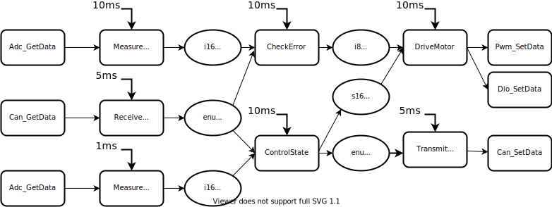
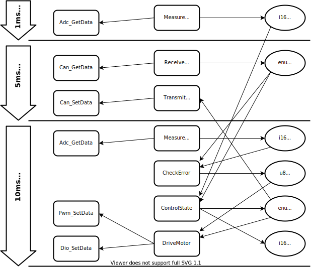
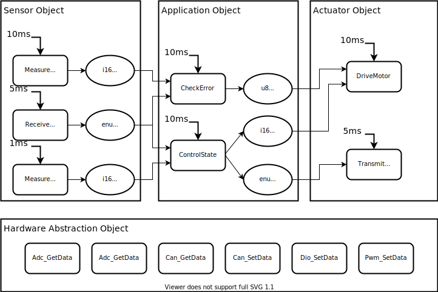
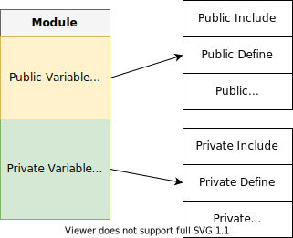
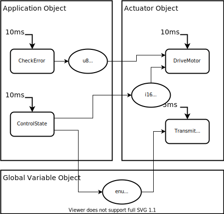
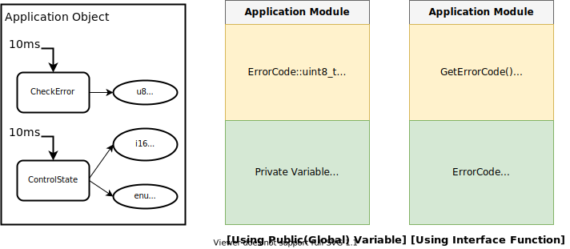

# 객체지향 프로그래밍: 모듈화 프로그래밍이란?

## 시작하는 질문

객체지향 프로그래밍은 무엇일까? 

객체지향 프로그래밍은 객체지향 프로그램 언어(C++, Java 같은) 를 사용해야만 한다?

------

## References

[The benefits of architecture & module *in xmc tutorial*](https://xmctutorial.readthedocs.io/ko/latest/ProgModuleMultipleFiles/index.html#the-benefits-of-architecture-module)

**[Example Code]**

* NONE

**[강의 영상]**

* [객체지향 프로그래밍이란?](https://drive.google.com/file/d/1WJAGiKlqxzWe2TsnW8NSQY8y_lNfE7ik/preview)

* [모듈화 설계 방법](https://drive.google.com/file/d/1OR9xyQEB8eNbtNHmGtTy9i8KALeAXLLf/preview)

------

## Objectives

* 객체지향 프로그래밍이란 무엇인지 이해한다.
* 모듈화 프로그래밍을 할 수 있도록 한다.

## 서론

* 객체지향프로그래밍은 1980 년대에 등장
    * C++, Java, SmallTalk 등의 언어가 탄생함
    * 객체지향 설계 방법이 등장하게됨 --> UML 등
* 임베디드 시스템에서는 객체지향언어보다는 기존의 Assembler 와 C 언어가 아직까지 대세
  * 수행속도, 메모리 사용의 문제
  * C 언어를 사용한 객체지향프로그래밍은 가능
* 기본적인 객체지향의 개념: Microsoft Press 에서 소개
  * ADT(Abstract Data Types)의 개념 소개
  * 간단한 C 언어의 구문: 구조체를 활용한 자료의 추상화와 함수 호출을 사용한 자료 접근
  * 소프트웨어를 객체로 나누어 프로그래밍 하는 방법

* 오늘날의 객체지향 개념
    * 상속, 다형성 등등 다양한 개념이 기본 객체지향개념에 추가됨
    * 객체지향 프로그래밍 언어를 사용하더라도 객체지향적으로 프로그래밍 되는 것은 아니다.
    * C언어로도 객체지향적인 소프트웨어를 만들 수 있다.
* 기본적인 **객체지향프로그래밍의 개념**을 정확히 아는 것이 중요

## 객체지향 프로그래밍이란?

### 객체지향의 원리

* 객체지향과 관계된 몇몇 정의들

> “An **object** is anything with a **crispy defined boundary**” (Brad J. Cox, Object-oriented Programming: An Evolutionary Approach (1991), Addison-Wesley)

> “**Encapsulation** is the process of **hiding all of the details** of an object that do not contribute to its essential characteristics” (Crady Booch, Object-oriented Analysis and Design with Applications, 2nd Edition, Benjamin Cummings, Redwood City)

> “**Encapsulation(Information Hiding)**: A principle, used when developing an overall program structure, that each component of a program should encapsulate or hide a single design decision. The **interface** to each module is defined in such a way as **to reveal as little as possible** about its inner workings”, (Peter Coad and Jill Nocola, Object-oriented Programming, Prentice Hall PTR, 1st Edition)

* 객체지향 소프트웨어의 중요한 개념
    * 소프트웨어를 **실생활의 객체로 구조화** 하는 것이다.
        * 객체란 실제로 물리적인 객체에 근거하여 정의하는 것이 좋다. 
        * 마이크로콘트롤러 시스템에서; 센서, 스위치, 액츄에이터, 필터, 적분기 등등
    * **자료와 함수(혹은 메소드)**는 객체의 중요 구성 요소이고 **명확한 경계**를 자기고 있어야 한다.
        * 객체에 접근하기 위하여 **정의된 인터페이스**를 가지고 있어야 한다. 인터페이스의 종류와 그 내용이 명확해야 한다.
    * 정보의 **은닉성**은 철저히 지켜야 한다. 
        - 외부에서 접근해야 하는 것은 인터페이스를 갖도록 하고
        - 그럴 필요가 없는 자료들은 철저히 숨겨져야 한다.

    

* 객체의 예: 사무실 의자

    * 사용자 인터페이스: 등받이, 받침, 팔걸이
    * 시스템 인터페이스: 5 개의 바퀴
    * 설정 인터페이스: 높이 조절 레버
    * 숨겨진 속성들: 나사들, 조절 메커니즘, 충격완충 장치, 받침의 소재 등등

### 객체지향 프로그래밍 언어

객체지향의 첫번째 사례는 C 언어를 사용한 ADT(Abstract Data Type) 이다.

이것은 객체지향 프로그래밍 언어가 시장에 나오기 전에 C 언어를 활용한 객체지향의 좋은 사례이다.

최근에 나온 객체지향 언어의 추가적인 기능은 객체지향프로그래밍을 보조적으로 도와주는 방법을 제공하는 것이지, 객체지향 프로그래밍 자체는 아니다.

* 다형성, 상속, 오버로딩 등등
* 이러한 보조적인 기능들은 객체지향프로그래밍 자체를 혼란스럽게 할 수 있다.

객체지향 언어인 C++을 사용하여 비객체지향적으로 프로그래밍 하는 사례들

* 하나의 큰 클래스를 만들고 변수를 모두 public 으로 선언하는 것
* 프랜드 클래스를 여러 개 만들어 변수를 자유롭게 접근하도록 하는 것

**[핵심]** 

* **객체지향 언어**를 사용했다고 해서 객체지향적인 소프트웨어가 되는 것은 아니다.

* 많은 객체지향 특징은 객체지향 **기본 원리**에 나중에 덧붙여 진 것이다.

* **객체지향 설계와 원칙**을 고수함으로써 객체지향 소프트웨어를 만들 수 있다.

## 절차지향 소프트웨어와 객체지향 소프트웨어

* 소프트웨어는 **자료**와 자료를 변환하는 **함수**의 결합
* 절차지향 설계법:
    * 자료의 **변환과정**에 집중하여 설계하는 방법
    * 제어흐름을 구성하는 것이 소프트웨어 설계
    * 제어흐름 자체가 소프트웨어의 구조가 됨
* 객체지향 설계법: 
  * 변환되는 **자료**에 집중하여 설계하는 방법
  * 자료흐름을 구성하는 것이 중요
  * 자료흐름 중심으로 소프트웨어 구조 생성

### [예제]

* MoBeE: Data flow diagram

* MoBeE: Procedure-oriented Design

* MoBeE: Object-oriented Design

## 모듈화 프로그래밍, 객체지향의 첫단계

* 모듈(Module)이란?
    * 관련이 높은 부분을 모아 놓은 것
    * 경계가 있고, 외부와 연결할 수 있는 인터페이스가 정의 되어 있는 것
* 모듈로 설계하고 만들때 얻어질 수 있는 장점
    * 구조화되어 **읽고 이해**할 수 있는 코드
    * 모듈단위로 **시험**할 수 있는 코드
    * 기존의 코드를 **재사용**하여 시간을 단축하고 품질을 향상할 수 있는 코드
    * 하나의 프로젝트를 **여럿이 함께** 진행할 수 있게됨
    * 향후 효율적으로 기능을 개선(**유지, 보수**)해 갈 수 있게됨

* 모듈 구현을 위해서 여러 파일로 프로그래밍 하는 방법을 알아야 한다.
    * C 와 Header 로 구분하는 방법
    * 모듈간 인터페이스 하는 방법
    * 변수와 함수의 Scope 와 Life-time 
    * 체계적인 인클루드 방법

    

* 2단계 가시성을 갖는 모듈과 구성 요소

### C source vs. Header

### 모듈사이의 자료 공유 방법

* Data와 함수를 묶는 방법

    * Data와 Data를 생성하는 함수를 묶는 방법
    * Data와 Data를 사용하는 함수를 묶는 방법
    
* Data들만 모아서 묶는 방법
  
* Data 공유 방법

    * 전역변수 

    * 인터페이스 함수

        
    

* `ErrorCode` in Application Object

    * `ErrorCode` Public Var 혹은
    * `GetErrorCode()` Interface 함수

* `BeltTensionRef` in Actuator Object

    * `BeltTensionRef` 혹은
    * `SetBeltTensionRef()`

* `State` in Global Variable Object

    * `enuState` 혹은
    * `GetState()` 와 `SetState()`

    

### 예제

### Exercise

* 위의 예제에서 Application Object, Actuator Object, Global Variable Object 를 2단계 가시성을 갖는 모듈로 설계해 보세요.

    * Global Variable로 자료를 교환하는 경우

    * Interface Function을 사용하는 경우 (Get, Set 함수 이용)

        

