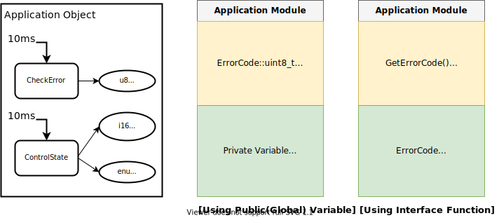

# 모듈화를 위한 코드 템플릿


## 시작하는 질문

모듈화를 위한 설계 방법은 이해를 하겠는데, 이것을 C 코드로 구현하려면 구체적으로 어떻게 해야 하는 것인가? 좋은 예제는 어디 없을까?


------


## References

* [Module section *in xmc tutorial*](https://xmctutorial.readthedocs.io/ko/latest/ProgModuleMultipleFiles/index.html#module-section)


**[Example Code]**

* EST_Module_Exercise/Template/
    * _TempBasic.h, _TempBasic.c

**[강의 영상]**

* [모듈화 구현 방법과 코드 템플릿](https://drive.google.com/file/d/11rVY1j5vhZt9zHR8E1VLFXA4SAGprZQY/preview)

    

## Experiment & Exercise

**[자료]**

* EST_Module_Exercise/markdown/Design_IntMath.pdf
* [라이브러리 예제의 C 라이브러리: 정수연산 IntMath 부분](LibExample.md)

**[Code]**

* EST_Module_Exercise/src/
    * _GivenIntMath.c, IntMath.h, IntMath.c
* EST_Module_Exercise/test/
    * test_IntMath.c

**[강의영상]**

* [모듈 만들기 Exercise 설명](https://drive.google.com/file/d/1QYOnF08XWJvdkABWVE9Sf0g4pirsXp8O/preview)
* [Integer 연산 관련 예제 설명](https://drive.google.com/file/d/1e6H5nBCv2Hr_9nlxSbGhaSilG7oD3L3M/preview)
* [Integer 연산 라이브러리 모듈 만들기](https://drive.google.com/file/d/1Gdlr70y65__ydx5UpZb2CCx_o_fc99rI/preview)

------


## Objectives

* 모듈화 프로그래밍을 위한 코드 템플릿을 이해하고 활용할 수 있도록 한다.


**[Example Code]**

`_TempBasic.h`, `_TempBasic.c`


## 서론

* 관련이 있는 **함수와 자료를 함께 묶어서 모듈화**하는 것이 중요
  
* 적절한 종류의 **자료를 정의하는 것은 중요**한 영역
  
    * 변수 선언 혹은 인터페이스 정의
    * 많은 경우에 구현의 문제로 심도있게 설계되지 않음
    
* 잘 설계된 모듈은 유지보수성, 이식성, 시험성 등등을 향상시킴
  
  

## 헤더에 들어가는 내용과 C 소스코드에 들어가는 내용은?

* 헤더는 포장지, C는 내용물

* 헤더: Public 정보

    * Public(Extern) 변수 선언
    * Public Function Declaration
    * 그리고 변수와 함수를 사용할 때 필요한 정보들

* C 소스: Private 정보

    * 전역 변수 선언, File-Scope 변수 선언
    * Public Function Definition
    * Private Function Declaration & Definition
    * 그리고 변수와 함수를 사용할 때 필요한 정보들

    

## 2단계 가시성을 갖는 모듈 템플릿

- 한개의 헤더와 C 소스코드 파일로 구성
- ! DoxyGen을 사용한 문서 생성 주석문 포함
- 알고리즘 구현을 위한 소스코드 템플릿
- 여러 모듈에서 공통으로 사용되는 헤더로 변형 해서 활용 가능


### Module.h

```c
/******************************************************************************/
/**
 * @file         _TempBasic.h
 *
 * @brief        Header file for _TempBasic
 *
 * @version      1.00
 * @date         Feb/18/2010
 * @warning
 * @note
 * <pre>
 * ---------------------------------------------------------------------------
 *               R E V I S I O N   H I S T O R Y
 * ---------------------------------------------------------------------------
 *   Date        Version  Author  Description
 *  ----------   -------  ------  --------------------------------------------
 *  2010-02-18   1.00             - Creation Release
 * </pre>
 *
 */
/******************************************************************************/

#ifndef _TEMPBASIC_H
#define _TEMPBASIC_H

/**
 * @defgroup Basic _TempBasic 
 * @{
 */

/******************************************************************************/
/* HEADER FILES                                                               */
/******************************************************************************/

/**** Standard types & definitions ****/
#include "PlatformTypes.h"

/**** Project types & definitions ****/


/**** Miscellaneous types & definitions ****/


/******************************************************************************/
/* DEFINITIONS AND MACROS                                                     */
/******************************************************************************/


/******************************************************************************/
/* TYPEDEFS AND STRUCTURES                                                    */
/******************************************************************************/

/**** enum type definitions ***************************************************/

/**
 *  @enum eScheStatus
 *	@brief Status of Scheduler
 */
//typedef enum eScheStatus
//{
//  RUNNING = 0,   /**< Running status */
//  ELAPSED          /**< Elapsed status */
//} eScheStatus_t;

/**** structures type definitions ********************************************/


/**** extra type definitions ****/

/******************************************************************************/
/* EXPORTED VARIABLES                                                         */
/******************************************************************************/

//extern eScheStatus_t Sch_eScheStatus;

/******************************************************************************/
/* EXPORTED FUNCTIONS                                                         */
/******************************************************************************/

/***************************************************************************/
/**
@brief      Initialization of the timer for scheduler
@param[in]  pParam   Pointer to the parameters structure.
@param[out] pState   Pointer to the state structure.
@param[in,out] pi32InBuf Pointer to a buffer for storing input signal
@return     void.
void Sche_InitTimer(const sScheTable_t * pParam,
                               eScheStatus_t * pState,
                               int32_t *pi32InBuf);
 */


#endif

/******************************************************************************/
/*                            EOF                                             */
/******************************************************************************/

/** @} */

```


### Module.c

```c
/******************************************************************************/
/**
 * @file         _TempBasic.c
 *
 * @brief        C file for _TempBasic
 *
 * @version      1.00
 * @date         Feb/18/2010
 * @warning
 * @note
 * <pre>
 * ---------------------------------------------------------------------------
 *               R E V I S I O N   H I S T O R Y
 * ---------------------------------------------------------------------------
 *   Date        Version  Author  Description
 *  ----------   -------  ------  --------------------------------------------
 *  2010-02-18   1.00             - Creation Release
 * </pre>
 *
 */
/******************************************************************************/


/**
 * @defgroup Basic _TempBasic
 * @{
 */

/******************************************************************************/
/* HEADER FILES                                                               */
/******************************************************************************/

/**** Standard types & definitions ****/

/**** Project types & definitions ****/

/**** Miscellaneous types & definitions ****/
#include "_TempBasic.h"

/******************************************************************************/
/* DEFINITIONS AND MACROS (scope: file)                                       */
/******************************************************************************/


/******************************************************************************/
/* TYPEDEFS AND STRUCTURES (scope: file)                                      */
/******************************************************************************/

/**** enum type definitions ***************************************************/


/**** structures type definitions ********************************************/


/**** extra type definitions ****/

/******************************************************************************/
/* EXPORTED VARIABLES (scope: exported)                                       */
/******************************************************************************/
//eScheStatus_t Sch_eScheStatus;

/******************************************************************************/
/* FILE VARIABLES (scope: file)                                               */
/******************************************************************************/


/******************************************************************************/
/* Function Prototype (scope: file)                                           */
/******************************************************************************/


/******************************************************************************/
/* Function Implementation (scope: file)                                  */
/******************************************************************************/


/******************************************************************************/
/* Function Implementation (scope: exported)                                  */
/******************************************************************************/


/******************************************************************************/
/*                                                                            */
/*                            EOF                                             */
/*                                                                            */
/******************************************************************************/

/** @} */

```


## 실습

* _GivenIntMath.c 파일을 IntMath 모듈로 만들어 보자


## Exercise



* Application Object를 구성해 보세요. (Interface 함수를 사용하는 방법으로)


