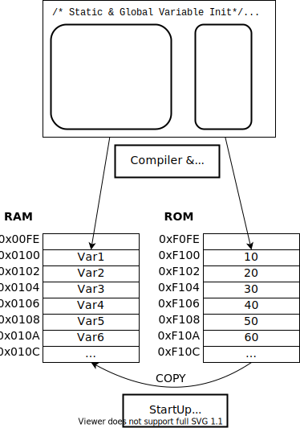
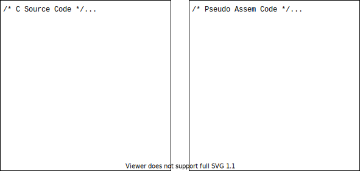

# 변수/함수의 Scope 와 Life-time

## 시작하는 질문

* 전역변수, 지역변수 이것은 구분지을 수 있는데 더 알아야 하는 내용이 있을까?


## References

* [Using multiple files in C *in xmc tutorial*](https://xmctutorial.readthedocs.io/ko/latest/ProgModuleMultipleFiles/index.html#using-multiple-files-in-cc)

**[Example Code]**

* NONE

**[강의 영상]**

* [변수와 함수의 Scope와 Life-time](https://drive.google.com/open?id=1Y-L_W4hO0vLT9yQR3Q05qlEDkmSkV19g)

* [변수와 관련된 좀 더 깊이있는 이야기](https://drive.google.com/open?id=171N17Bor3TZMEzyfJSEumDBqrUyH-oXL)

    

## Experiment & Exercise

**[자료]**

* EST_Module_Exercise/markdown/Design_UserLib.pdf
* [라이브러리 예제의 기능 라이브러리: UserLib 부분](LibExample.md)

**[Code]**

* EST_Module_Exercise/src/
    * _GivenHysteresis.c, _GivenRampe.c, UserLib.h
* EST_Module_Exercise/test/
    * test_UserLib.c

**[강의영상]**

* [Unity 간략 설명](https://drive.google.com/file/d/11w7y53zlyKFL466XA88T4Xuesxvpwp14/preview) 
* [Hystersis 함수 설명과 모듈화 하기](https://drive.google.com/file/d/1nBxdQqpYLkiaClMd5ebEZ0ipYS9XPibe/preview)
* [Ramp 함수 설명과 모듈화 하기](https://drive.google.com/file/d/1BAkADshPkg4o5BVYhVW0te5E7m1qa3Pk/preview)

------


## Objectives

* 함수의 Scope를 이해한다.
* 변수의 Scope 와 Life-time을 이해한다.


## 변수의 Scope

* 전역변수와 지역변수
    * 일반 프로그래밍에서는 전역변수 사용을 최소화 할 것을 권고 한다.
    * Embedded Programming에서는 전역변수의 사용을 제한적으로 허용한다.
* 변수의 사용에 있어서 `static` 키워드의 용도가 두가지가 있어서 오해의 소지가 있다.
    * `static` 전역변수
    * `static` 지역변수


### 전역변수: Exported Variable

* **함수 외부에 선언된 모든 변수(static 없이)**는 전역변수

    * 다른 모듈에서 자유롭게 읽고 쓸 수 있다. 
    * 모듈의 외부로 보이는 변수라는 의미로 **Exported Variable** 라고 구분한다.
    * 객체 지향적 관점으로 보면 **Public Variable** 이 여기에 해당한다.

* 다른 모듈에서 이 변수에 접근하고자 한다면 `extern` 사용하여 변수를 선언하여야 한다.

    * 일반적으로 모듈의 c 파일에 정의하고
    * 모듈의 h 파일에 `extern` 키워드를 붙여 선언한다.

* 정적변수 영역에 위치한다.

* [예]

    `ExportedVar`


### 모듈 범위 정적변수: File scope Variable

* **함수 외부에 `static` 으로 선언**된 전역변수

    * 모듈(파일) 내부의 Scope 범위를 갖는다; Module(File)-Internal Linkage
    * 모듈(파일) 내부에서만 접근이 가능한 변수라는 의미로 **File Scope Variable** 라고 구분한다.
    * 객체 지향적 관점으로 보면 **Private Variable** 이 여기에 해당한다.

* 모듈 내부의 여러 함수에서 접근이 가능하고 그 값은 지속적으로 유지 된다.

    * 정적변수 영역에 위치한다.

* 명시적으로 초기화 하는 것이 바람직 하다.

    * 선언과 함께 초기화를 하는 방법
    * 초기화 함수를 별도로 구성하는 방법

* [예]

    `StaticVar`


### 함수 범위 정적변수: Static Variable

* **함수 내부에 `static`으로 선언**된 지역변수

    * 함수 내부의 Scope 범위를 갖는다.
    * 일반적으로 **Static Variable** 라고 구분한다.

* 함수가 최초에 실행될 때 선언과 함께 초기화 되고, 함수가 종료되어도 그 값을 지속적으로 가지고 있다.

    * 정적변수의 초기화는 명시적으로 해주는 것이 바람직
    * 정적으로 변수값을 유지해야 하므로 정적변수 영역에 위치한다.

* [예]

    `static_var`, `static_another`


### 지역변수: Local Variable

* **함수 내부에 선언**된 변수와 **함수로 전달되는 파라메터** 변수

* 함수내 범위를 갖기 때문에 다른 함수에서 같은 이름의 변수를 사용할 수도 있다.
    - 그러나 같은 이름을 사용하는 것은 오류를 범할 가능성을 높임
    - 가능하면 다른 이름을 사용하는 것이 바람직  MISRA-C

* **automatic** 변수라 불리기도 함

    - 일단 CPU 의 Register 에 변수를 할당하고자 함
    - Register 의 공간이 부족하면 Stack 에 변수를 할당 함

* 지역변수의 장점
    - 정적변수 영역을 사용하지 않음
    - Register 를 사용하는 경우 수행속도가 빨라짐

* [예]

    `local_var`, `local_another`


## 변수의 Life-time

* 정적 영역에 할당되는 변수
    * Exported Variable, File Scope Variable, Static Variable
    * 프로그램의 시작과 함께 영역이 할당되고 값이 지속됨
    * 선언과 함께 초기화 여부에 따라 BSS 혹은 Data 영역에 할당
    * 초기값은 ROM의 CONST 영역에 할당

* 스택(+Register)에 할당되는 변수
    * Local Variable
    * 함수의 시작과 함께 할당되고 함수의 종료시 반환됨




## 함수의 Scope

* 전역함수와 지역함수(?)라는 용어를 명시적으로 사용하고 있지는 않지만 Scope 에 따라 분류할 필요가 있다.

### 전역함수: Exported Function

* 다른 모듈에서 자유롭게 호출할 수 있다. 

* 모듈의 외부로 보이는 함수라는 의미로 **Exported Function** 라고 구분한다.

* 다른 모듈에서 이 함수에 접근할 수 있도록 모듈의 h 파일에 Prototype을 선언한다.

* 객체 지향적 관점으로 보면 **Public Function** 이 여기에 해당한다.

* [예] 

    `ExportedFunc()`

### 모듈 범위 함수: File Scope Function

* 모듈 내부에서만 호출할 수 있다. 

* 모듈 내부에서만 보이는 함수라는 의미로 **File Scope Function** 라고 구분한다.

* 모듈의 c 파일에 Prototype을 선언한다.

* 객체 지향적 관점으로 보면 **Private Function** 이 여기에 해당한다.

* [예]

    `static_func()`





## 좋은 설계를 위한 자료 정의의 원칙

* 가능한한 자료는 지역변수로 선언한다.
* 자료의 값을 다음 호출에서도 사용해야 한다면 함수내 범위를 갖는 정적변수로 선언한다.
* 모듈내의 여러함수에서 공통으로 접근해야 한다면 모듈내 범위를 갖는 정적변수로 선언한다.
* 전역변수의 사용을 정말로 피해보자. 전역변수를 자주 사용해야 한다면 그것은 잘못된 설계이다.


## 변수와 관련된 배경 지식

### 지역 변수의 초기화

* 변수의 선언과 초기화를 동시에 할 수도 있고 개별적으로 할당할 수도 있다.
    * 지역 변수의 경우 두가지 동작이 동등하다.
    * 실제 선언과 초기화를 동시에 하였을 경우, 컴파일러가 변수를 선언하고 초기화 하는 동작으로
      나눠서 수행한다.
* 지역변수를 선언하면 ‘0’으로 초기화 되는 것은 아니다.
  * 지역변수가 Register, 혹은 Stack 에 할당되었을 경우 이전의 수행결과 값이 남아있을 수 있다.
  * 지역변수를 꼭 초기화 하는 습관을 갖도록 하자.

```c
/* Local Variable Declaration with Initialization */
int16_t variable = 10;

/* Local Variable Declaration and Initialization */
int16_t variable;
variable = 10;
```


### 정적변수의 초기화

* 정적변수와 전역변수의 초기화 절차

    1. 링커가 정적변수와 전역변수를 모두 묶어서 RAM 의 한 공간에 할당한다.
    2. 동시에 링커가 각 변수의 초기값 또한 모두 묶어서 ROM 에 할당한다.
    3. 프로그램 시작시 ROM 의 초기값을 RAM 에 순차적으로 복사하여 초기화 한다.

    

* 초기값이 없는 변수들의 처리
  * ‘0’으로 초기화 될 것이라는 예상은 금물
  * 현재 많은 컴파일러가 초기값이 없는 정적변수와 지역변수를 기본값, ‘0’,으로 초기화
  * 이러한 기능은 C 언어의 표준이 아님
  * 명백하게 초기화하는 것이 바람직한 습관

  
  
  


**[참고]** Start-up Routine

* Start-up 루틴은 마이크로컨트를러가 시작되면서(Reset 직후) 최초로 수행되는 작은 프로그램이다.
* 역할
    * 마이크로컨트롤러의 초기화: 특별한 기능을 가진 레지스터 초기화, 버스 설정, 메모리 wait state
      설정 등등
    * 정적변수와 지역변수의 초기화: ROM 에 저장되어 있는 초기값을 각 변수의 RAM 번지로 복사
    * main 프로그램의 호출


### 전역변수의 효율성

* 전역변수를 사용하는 것이 결코 효율적인 자료교환 법이 아니다.
* 최대한 전역변수 사용을 자제하고 지역변수를 활용한다면, 
    * 상당량의 RAM 을 절약함은 물론, 수행속도도 높일 수 있다.


* [Function with Global Variables]


* [Function with Local Variables]




## 실습

* _GivenHysteresis.c 와 _GivenRamp.c 파일의 내용을 모아서 UserLib 모듈로 만들어 보자