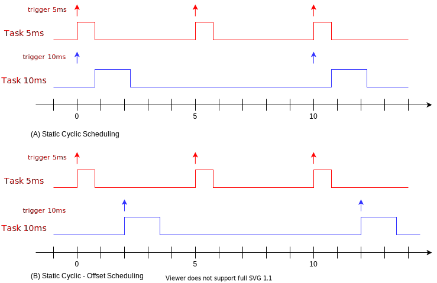
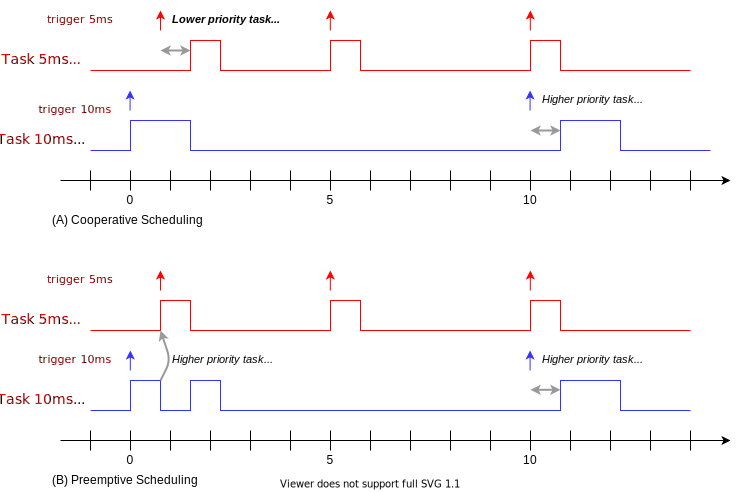

# 운영체계와 스케쥴링


## 시작하는 질문

실제 마이크로컨트롤러 프로그램을 구성할 때는 **여러개의 수행 주기를 가진 일들을 동시에 실행** 해야 하는데 어떻게 구성할 수 있지?

------


## References

* [XMC Tutorial - Scheduler](https://xmctutorial.readthedocs.io/ko/latest/ProgSystemTimerScheduler/index.html)

**[Example Code]**

* [In Lecture]

**[강의 영상]**

*   [Task와 Scheduler](https://drive.google.com/file/d/1Um0yAoTekPtPTO52jJGZB3hv0qRuKHF4/view?usp=sharing) (in XMC Tutorial)
*   [Interrupt와 Scheduler](https://drive.google.com/file/d/1kV4IVsf8exh7cg4LM5M9tuRNK6El1AcS/view?usp=sharing) (in XMC Tutorial)
*   [Static Cyclic Scheduler](https://drive.google.com/file/d/1_O12IdvWccj77IUbqQTeJ8hzNS_9RYZb/view?usp=sharing) (in XMC Tutorial)
*   [Scheduler의 종류](https://drive.google.com/file/d/1S1Xegr5t-4RDMNKtxcPJABejRFy2HMha/view?usp=sharing)
*   [자료의 공유시 발생하는 문제들](https://drive.google.com/file/d/1cUXXhU1qqHe1qoDGYlkt85rhDuEYktRr/view?usp=sharing)

## Experiment & Exercise

* Scheduling & Integration 하기

**[자료]**

* EST_MoBeE/markdown/3_SwDesign.pdf
* EST_MoBeE/markdown/3_InterfaceParameters.xlsx

**[Code]**

* StaticScheduler.h, .c

**[실습영상]**

* [Static Cyclic Scheduler in PC](https://drive.google.com/file/d/1VpzXCs1oLRT8HLWzDq0wp6b2N8x8cOAa/view?usp=sharing)
* [실시간 설계와 구현](https://drive.google.com/file/d/1e3UP8xnKlQLtfmoxvE8S_VcDxsnzWFaI/view?usp=sharing)

**[연습영상]**

* [NONE]


## Objectives

* 시스템타이머를 사용하여 실행주기가 다른 여러개의 함수들을 실행시킬 수 있는 방법을 익힌다.


## Task와 Scheduler

* 태스크: 같은 조건으로 실행되는 동작의 묶음
* Scheduler: 태스크를 실행시켜 주는 소프트웨어

* [XMC Tutorial - Task & Scheduler](https://xmctutorial.readthedocs.io/ko/latest/ProgSystemTimerScheduler/index.html#task-scheduler)


## Interrupt와 Scheduler

* [XMC Tutorial - Interrupt와 Scheduler](https://xmctutorial.readthedocs.io/ko/latest/ProgSystemTimerScheduler/index.html#interrupt-scheduler)


## Scheduler의 종류

### Static Cyclic Scheduling

* 해야하는 일들을 주기적인 테이블로 만들어 실행




### Fixed-priority Scheduling

* 설계시에 고려한 정적 우선순위에 따라 실행
* 대부분의 RTOS 에서 지원하는 방식
* 보다 우선순위가 높은 일이 활성화 될 때, 
    * Cooperative Scheduling: 하던 일을 마칠 때까지 기다렸다가 실행 (Non-preemptive)
    * Preemptive Scheduling: 하던 일을 중단하고 높은 일 부터 실행(인터럽트와 유사)



[비교]

* 협력적 운영체계

    * 장점: 구현이 상대적으로 간단하다
    * 단점: 태스크의 실행 주기가 부정확해질 수 있다. (jitter 가 커진다)

* 선점형 운영체계

    * 장점: 이론적으로 CPU의 부하를 100% 까지 높일 수 있고, 태스크의 실행 주기를 상대적으로 정확하게 유지할 수 있다.
    * 단점: 충분한 스택 메모리 공간을 필요로 한다.

    

### 자료를 공유할 때 발생하는 문제

다른 실행 주기, 혹은 실행 조건으로 동작하는 태스크 사이에 자료를 공유할 경우 다음의 문제점들이 발생할 수 있다.

* Sample Rejection: X[.] 의 경우
    * X[1], X[2]는 버려지고, X[3]만 사용된다.
* Vacant Sample: Y[.]의 경우
    * T5m[2], T5[3]을 위한 Y[.]가 없어서 Y[1] 으로 대신한다.
* Data Consistency Problem: Preemptive Scheduling의 T10[1]의 경우 
    * 전반부에서는 X[0] 값으로, 후반부에서는 X[1]의 값으로 처리하게 된다.
    * 한 실행 내에서 두개의 값이 다르다 (Consistency Problem)


* Data Consistencxy Problem을 해결하기 위한 좋은 습관

    * 태스크의 실행시 다른 태스크와 공유되는 자료는 복사해서 지역변수로 만들어서 사용한다.

        

    ```
    Task10ms()
    	Read X[.] and copy my_x
    	... Do something using my_x ...
    	... Calculate my_y instead of Y[.]
    	Assig my_y to Y[.]
    	Write Y[.]
    ```

    


