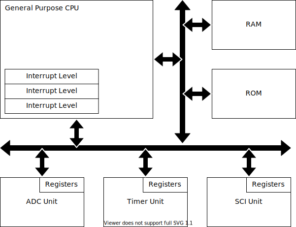
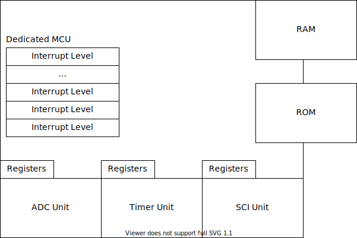
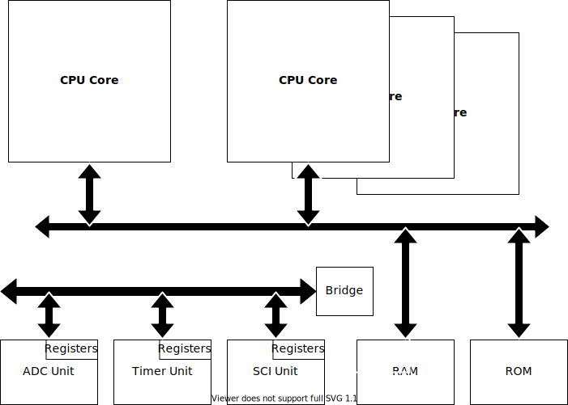
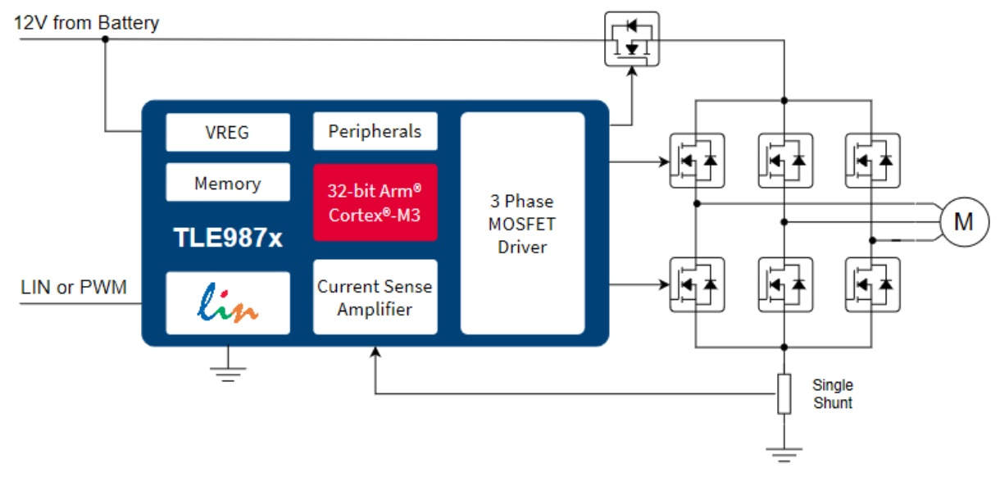
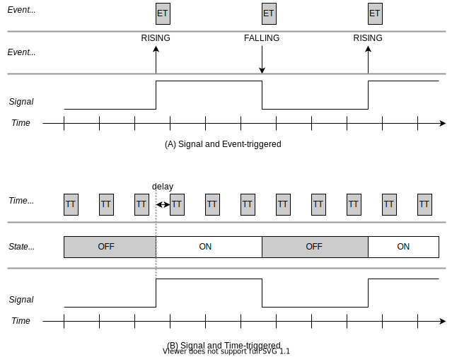

# 마이크로컨트롤러용 소프트웨어의 구조적 특징

## 시작하는 질문

* 일반 PC 프로그램과 마이크로컨트롤러 프로그램의 차이는?

------

## References

* [XMC Tutorial - Interrupt](https://xmctutorial.readthedocs.io/ko/latest/Interrupt/index.html)

* [AURIX Tutorial - What is iLLD](https://aurixtutorial.readthedocs.io/ko/latest/WhatIsIlld/index.html)

* [AURIX Tutorial - Do me a Favor?](https://aurixtutorial.readthedocs.io/ko/latest/DoMeAFavor/index.html)

* [wikipedia - Event](https://en.wikipedia.org/wiki/Event_(computing))

* [wikipedia - Interrupt](https://en.wikipedia.org/wiki/Interrupt)

* [wikipedia - Exception](https://en.wikipedia.org/wiki/Exception_handling)

    

**[Example Code]**

* NONE

**[강의 영상]**

*   [Microcontroller의 구조](https://drive.google.com/file/d/1D1VFABJH4zWb031hw-VDt5dw-gjW92uR/view?usp=sharing)
*   [외부 사건 처리 방법](https://drive.google.com/file/d/1x7fhCXcEFfXJKDLNpNPsPjsXrvMKH1xl/view?usp=sharing)

## Experiment & Exercise

* HAL 관련
    * MockUp
* Sensor, Actuator 관련
    * MeasureBeltTension() 분석
    * MeasureSupplyVoltage() 완성
    * DriveMotor() 완성

**[자료]**

* EST_MoBeE/markdown/3_SwDesign.pdf
* EST_MoBeE/markdown/3_InterfaceParameters.xlsx
  

**[Code]**

* SensorSWC, ActuatorSWC 

**[실습영상]**

* [단위 시험을 위한 환경 구축 방법, Mock-Up](https://drive.google.com/file/d/10gO9lK0jw1aAgqJw7ju03JiklemCVP72/view?usp=sharing)
* [SensorSWC - MeasureBeltTension 코드 분석](https://drive.google.com/file/d/1TG-dEI4hs295DwqyH2d9HCwKuL7tGVla/view?usp=sharing)

**[연습영상]**

* [SensorSWC, ActuatorSWC 기능 구현](https://drive.google.com/file/d/1Xv3SXLclULKAxrZFZQZeoZzU7Iec1QxF/view?usp=sharing)

------

## Objectives

* 소프트웨어 개발자 입장에서는 마이크로컨트롤러 프로그램의 차이를 이해한다.

## 마이크로컨트롤러 프로그램의 차이는?

* 대부분의 경우 자원(CPU와 Memory)이 제한적이다.

    * 메모리 용량과 실행시간 측면에서 최적화는 아니더라도, 일정 수준의 고려는 필요하다.

* 실수연산을 제한적으로 사용해야 하는 경우가 많다. 

    * FPU(Floating Point Unit)이 없는 경우가 있다.
    * 정수 연산을 잘 활용해야 한다.: Fixed-point Math, Q-Math

* 일반적으로 OS 가 없는 환경에서 프로그래밍한다는 것이다. : 저수준의 이해 필요

    * 인터럽트 모델과 트리거링
    * 메모리 모델: Linker Script

* 입출력을 직접 처리해야 한다: Device driver 와 HAL 필요

    * 레지스터 모델
    * 인터페이스 하드웨어에 대한 이해

    

## 마이크로컨트롤러의 구조

### 일반 CPU를 사용한 마이크로컨트롤러

* 32-bit 급 대부분: ARM(Cortex-M), Tri-Core, PowerPC

[일반 CPU 를 사용한 마이크로컨트롤러의 구조]

[핵심]

* 주변장치들이 내부 버스를 통하여 CPU 와 연결되며 필연적으로 시간지연을 갖게 된다.

    * 주변장치의 프로그래밍이 상대적으로 복잡하고 여러 제한조건을 갖고 있다.
    * 주변장치들이 매우 강력하며 CPU 와 독립적으로 동작한다.

* 제공되는 인터럽트 레벨의 개수가 제한되어 있다. 인터럽트 컨트롤러 활용

    * 주변장치의 각종 이벤트들을 개별적인 인터럽트로 할당하기가 불가능하다.

* CPU 코어를 대량 생산하는 모델이 일반적이어서 상대적으로 가격이 저렴하다.

    * 개발환경과 각종 라이브러리를 공용으로 사용할 수 있다.

    

### 전용 CPU를 사용한 마이크로컨트롤러

* 많은 8-bit, 16-bit MCU: 8051, AVR, S12 

[전용 CPU를 사용한 마이크로컨트롤러의 구조]

[핵심]

* 제어레지스터가 내부버스 번지에 할당되고 매우 빠른 속도로 접근 가능하게 된다.
* 최적의 입출력 처리를 위하여 매우 많은 인터럽트 레벨을 가지고 있다.
    * 주변장치의 각종 이벤트를 개별적인 인터럽트에 할당할 수 있어, 최적의 입출력 처리가 가능하다.
* 전용 마이크로컨트롤러는 매우 효율적으로 프로그래밍 할 수 있으며, 안정적인 응용시스템 개발이 가능하다.

### Multi-core & Hybrid-core 마이크로컨트롤러

* CPU의 Clock speed 를 증가한 성능 개선의 한계. 특히 MCU는Clock 속도를 높이는데 한계가 있다. 

    * 외부 IO를 처리해야 하기 때문에 (Clock에 의한 방사 노이즈 영향)
    * 전력 소비를 줄여야 하기 때문데 (Clock을 높이면 전력 소모가 많아진다.)

* 여러개의 Core를 On-Chip 에 구현

    * Multi-core:  동일한 Core 를 두개 이상 
    * Hybrid-core: 이종의 Core를 두개 이상

* 설계와 통합시 새로운 방법이 필요 => 분산형 스케쥴링 방법 

    * 태스크를 Core에 할당하는 방법

    * 메모리를 통해서 자료를 공유할 때 충돌을 방지하는 방법

        

[Multi-core 혹은 Hybrid-core 마이크로컨트롤러의 구조]

### Application Specific 마이크로컨트롤러 (Mixed-signal)

* 특정 용도를 위하여 CPU와 Analog Device를 On-chip에 통합: TLE98XX (infineon), Magni-V(nxp)

    * 전원부, 통신부(Tranceiver), Gate Driver 등등

* 장점

    * 경제성 향상
    * Board 크기 감소

* 단점

    * 내부 Device와의 연결에서 발생하는 문제 확인이 매우 어려움

    

## 인터럽트와 외부 사건 처리방법

* 제어 및 신호처리 시스템은 외부 사건에 대하여 반응을 보이는 동작을 수행하게 된다.
    * 마이크로컨트롤러는 외부 사건을 처리하는 Interrrupt라는 매커니즘을 가지고 있다.
    * Interrupt를 잘 이해하고 적절하게 활용하는 것이 매우 중요한 요소이다.

### Interrupt, Exception

* 기본적인 내용 설명 생략: [XMC Tutorial - Interrupt](https://xmctutorial.readthedocs.io/ko/latest/Interrupt/index.html) 참고
    * Polling 과 Interrupt 비교
    * 인터럽트의 처리 매커니즘
    * 인터럽트 활용 주의 사항

    

* 이벤트(Event) in wikipedia

    > In computing, an **event** is an action or occurrence recognized by software, often originating [asynchronously](https://en.wikipedia.org/wiki/Asynchronous_I/O) from the external environment, that may be handled by the software. Computer events can be generated or triggered by the system, by the user or in other ways. Typically, events are handled [synchronously](https://en.wikipedia.org/wiki/Synchronisation) with the program flow, that is, the software may have one or more dedicated places where events are handled, frequently an [event loop](https://en.wikipedia.org/wiki/Event_loop). A source of events includes the user, who may interact with the software by way of, for example, keystrokes on the keyboard. Another source is a hardware device such as a timer. Software can also trigger its own set of events into the event loop, e.g. to communicate the completion of a task.

* 인터럽트(Interrupt) in wikipedia

    > In digital computers, an **interrupt** is a response by the processor to an event that needs attention from the software. An interrupt condition alerts the processor and serves as a request for the processor to interrupt the currently executing code when permitted, so that the event can be processed in a timely manner. 
    >
    > - If the request is accepted, the processor responds by suspending its current activities, saving its state, 
    > - and executing a function called an *interrupt handler (or an interrupt service routine, ISR)* to deal with the event. 
    > - This interruption is temporary, and, 
    > - unless the interrupt indicates a *fatal error*, the processor resumes normal activities after the interrupt handler finishes.

* 예외처리(Exception-handling) in wikipedia

    > In computing and computer programming, **exception handling** is the process of responding to the occurrence of *exceptions* – anomalous or exceptional conditions requiring special processing - during the execution of a program. In general, an exception breaks the normal flow of execution and executes a pre-registered *exception handler*; the details of how this is done depend on whether it is a hardware or software exception and how the software exception is implemented. It is provided by specialized programming language constructs, hardware mechanisms like **interrupts**, or operating system(OS) inter-process communication(IPC) facilities like signals. Some exceptions, especially hardware ones, may be handled so gracefully that execution can resume where it was interrupted.

### 외부 사건의 처리 방법: Event-Trigger vs. Time-Trigger

#### 외부 사건, 혹은 정보를 처리하는 두가지 방법

* 관점의 차이: Event Info vs. State Info

| 항목                | Event-triggered   | Time-triggered         |
| ------------------- | ----------------- | ---------------------- |
| Information aspect  | Event information | State information      |
| Processor aspect    | Interrupt         | Polling                |
| Load depends on ... | event period      | time period            |
| missing information | Malfunction       | Delayed function       |
| Response            | Immediate         | Small jitter           |
| Application         | General system    | Safety critical system |

#### [참고] **Multi-rate**: 제어 혹은 신호처리 시스템에서 해야하는 일의 시간 속성

* 디지탈 제어, 혹은 신호처리에서 일정 실행 주기(샘플링 타임)을 전제로 한다.
* 샘플링 타임은 임의로 결정하는 것이 아니라 대상 시스템, 혹은 신호의 속성에 따라 결정한다.
    * 제어시스템의 경우 제어 대상의 응답속도에 따라 결정된다.
    * 신호처리 시스템의 경우 처리하는 신호의 주파수 대역에 의해서 결정된다.
* 시스템 내에서 일의 처리
    * 간단한 시스템의 경우 일반적으로 하나의 샘플링 주기, Single-rate,로 동작하지만
    * 대부분 여러가지 입출력과 그에 따르는 몇개의 루프를 갖게 되므로 Multi-rate로 동작하게 된다.
    * 아울러 입출력 신호의 속성에 따라 Event-triggered 처리부도 부분적으로 갖게 된다.

## 메모리 관련 (향후 보완)

* const vs. #define

* volatile & optimization

* 링커스크립트

